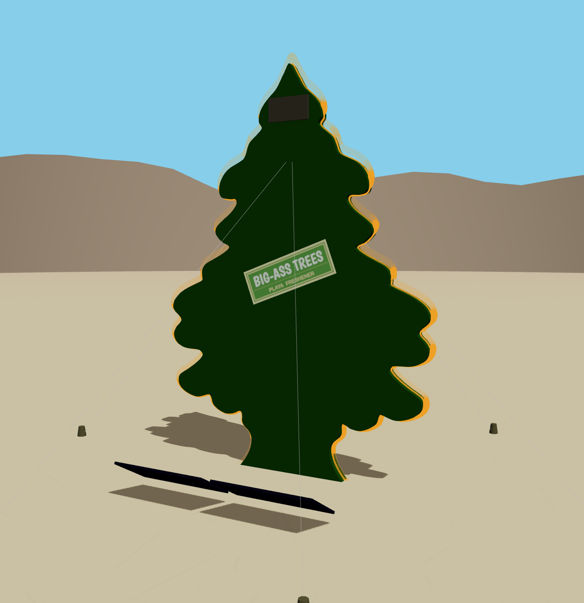

# Little Trees 🌲

**Burning Man 2026 Art Installation**

[Live 3D Visualizer →](https://raywu.github.io/little-trees/) | [GitHub →](https://github.com/raywu/little-trees)

## Overview
14-ft sculptural silhouette of the classic Little Trees car air freshener. Combines
sculpture, scent, LED lighting, and solar power into a sensory landmark on the playa.

- Height: 14 ft · Width: 7 ft · Thickness: 5 in
- Base: 8×8 ft | Wind-rated: 50+ mph
- Budget: $2,730 | Crew: 3–4 | Build: 4–6 weeks
- 100% solar powered with 2–3 day battery backup

## Scent Rotation
A different fragrance each night for 7–9 nights:
Black Ice → Pine/Forest → Lavender → Citrus → Vanilla/Spice → Eucalyptus → Sandalwood/Cedar

## Structure
- Frame: 1.5" square steel tubing (~200–300 lbs)
- Skin: 6mm Coroplast (translucent, LED-backlit)
- Anchoring: 6 helical ground anchors (48" depth), 45° guy wires

## Lighting
- 12V LED strip (60 LEDs/m, 40–50 ft perimeter)
- RGB addressable, dusk-to-dawn (12 hr)
- Guy wire safety markers every 2–3 ft

## Power
- 2× 100W solar panels + 2× 200Ah AGM batteries (2,400 Wh)
- Daily load: ~880 Wh (LEDs 600 + fans 200 + losses 80)

## Spec
See [little-trees-installation-spec.pdf](./little-trees-installation-spec.pdf) for full
BOM, timeline, risk assessment, and installation procedures.
